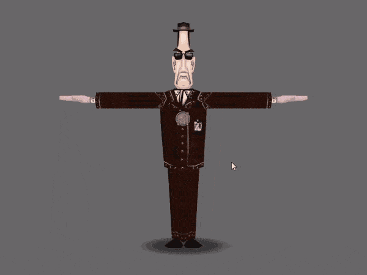
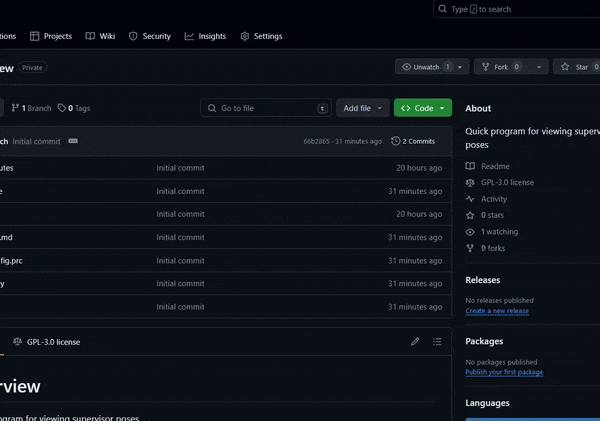

# Visor-View
Quick program I threw together for a friend, VisorView allows you to view, pose and screenshot animations on the Toontown Rewritten supervisor cogs.

# Usage
## Prerequisites
Using this program assumes that you are aware of how to extract game assets from phase files and that you already have them ready before starting. If you're unfamiliar with this process, there is a [beginner's tutorial on the Toontown Rewritten wiki](https://toontownrewritten.wiki/Phase_files). This will also show you where to download the Panda3D SDK.

**Please note** that, as of April 9th 2024, Under New Management has **not been released on the live servers**. Therefore, you will need a copy of the Under New Management playtest phase files to run the program.

Please ensure you have [Python 3](https://www.python.org/downloads/) installed before continuing. As well as this, please ensure you have Panda3D installed as a python module by running `py -m pip install Panda3D` (replace py if you know you use a different alias, i.e. python3, python). 

This command should be run in your **terminal**, if you use Linux, or your **command prompt** if you use Windows. The command prompt can be accessed by accessing the run dialog (Ctrl + R) and typing `cmd.exe`.

## Running
Before running, take your extracted phase files (You should have these from the prerequisites section) and put them in the `resources` folder in the root directory (the same folder that `src` folder is in). If this directory doesn't exist, you can make it yourself, or run the program once to generate it automatically.

You can run the program by double-clicking the provided .bat file in the `scripts` directory (on windows) or by running `py main.py`, from the main directory, in your terminal/command prompt. Provided everything is in place, you should be greeted with a graphics window displaying a t-posing cog. If there are any errors, make sure you put **all** of the phase files in the resources folder.

## Controls
The following inputs are available:
Key           | Action
------------- | -------------
Space         | Cycle between 5 different supervisor cogs (including Angry Foreman)
s             | Toggle Shadow. The drop-shadow below the cog will be toggled on/off.
a             | View animation list. This list can be scrolled, and entries can be clicked to switch the active animation. **Some controls are disabled when this menu is open!**
p             | Toggle Pose Mode. When pose mode is active, the cog's animation will pause, and the scrollwheel can be used to cycle through the animation's frames.
b             | Toggle animation blending.
r             | Reset the camera's roll. Roll is an axis of rotation. Think of it like turning the camera clockwise from its POV.
f9            | Take screenshot. This will be stored to the `screenshots` directory by default.
Control+Z     | Reset to default camera position, positioning it directly in front of the cog.
Mousewheel    | Can be used with the animations menu or pose mode. See **p** and **a** controls for instructions.

This program uses the default Panda3D camera controls. See the gif below for controlling the camera with your mouse.

# FAQ
## I'm not familiar with GitHub. How do I download the code?
If you don't know how to use git, you can download a zipped version of the code from the main page:

You can also [click here](https://github.com/BoggTech/VisorView/archive/refs/heads/main.zip) to download the zip.

Extract this into a folder of your choosing, and follow the steps outlined in **Usage**.

## I did everything, but I'm having errors.

Feel free to register a github account and write an [issue](https://github.com/BoggTech/VisorView/issues/new/choose). I'll try fix it if it's a problem, or guide you if it's not. You can also send me an email to my gloop.group address written on my GitHub profile.

# Acknowledgements

Special thanks to Panda3D and Python and their contributors. 

Toontown Online and Toontown Rewritten assets belong to their respective owners. Thank you to all of the artists and animators for their work on the cogs, as well as the rest of the Toontown team!